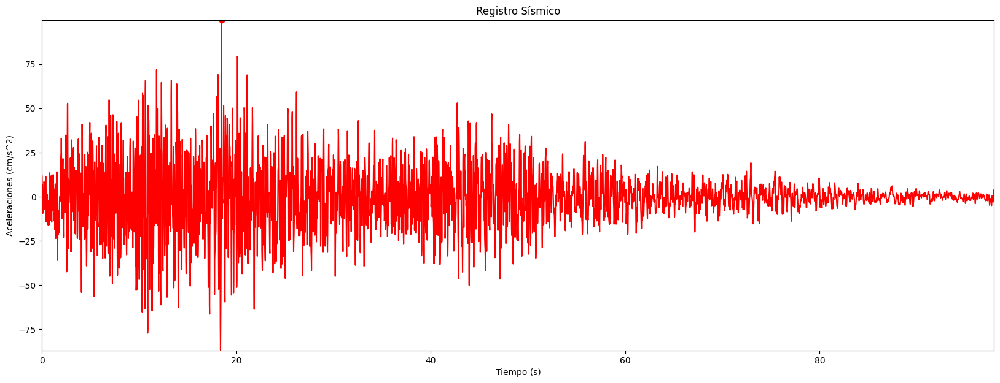
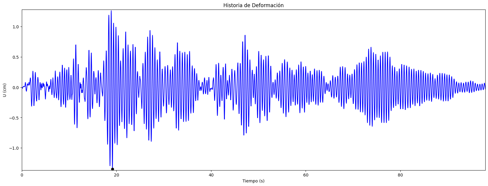
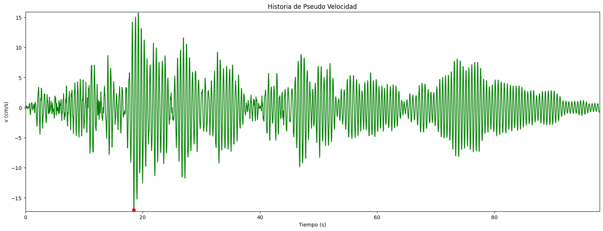
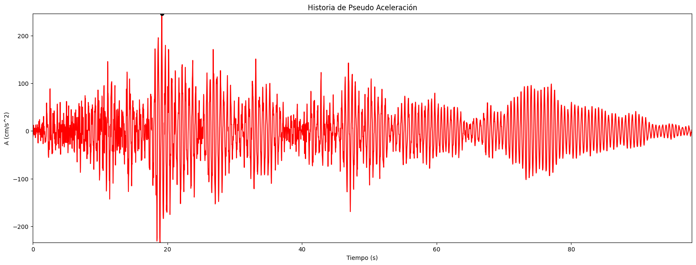

<center><span style="font-size: 40px; color: #000080;"><b>PORTAFOLIO</b></span></center>

<center><span style="font-size: 20px;"><b>PROYECTOS DE INGENIERÍA ESTRUCTURAL</b></span></center>

---
# **1. INGENIERIA SISMORESISNTE**

## **1.1. TIEMPO HISTORIA**

[](https://colab.research.google.com/drive/1x_ca2-5u-1tdmCVc-W1JuR15ZftuTgDx?usp=sharing)

**<font color="skyblue"><i>importar librerias</i></font>**
```Python
import pandas as pd
import numpy as np
import matplotlib.pyplot as plt
from tabulate import tabulate
```
**<font color="skyblue"><i>Importacion del registro corregido</i></font>**
```Python
# Especifica la ruta de tu archivo .xlsx
archivo_excel ='sismopy.xlsx'

# Carga el archivo Excel en un DataFrame de pandas
df = pd.read_excel(archivo_excel)

# Convierte el DataFrame a una matriz numpy de nx2
acce1 = df.values
```
**_<font color="skyblue">Datos de entrada</font>_**
```Python
Tn = 0.5
psi = 0.02
k = 1
v0 = 0
u0 = 0
b = 0.25
g = 0.5
```
**_<font color="skyblue">Calculos de "m", "c", "pt" y "dt"</font>_**

```Python
m = (Tn**2 / (4 * np.pi**2)) * k  # masa calculada en función de T y k (kip*s^2/in)
c = psi * 2 * ((m * k)**0.5)  # coeficiente de amortiguamiento (kip*s/in)
pt = acce1[:, 1] * (-m)  # vector de carga aplicada a las masas por movimiento en la base
dt = acce1[1, 0] - acce1[0, 0]  # tamaño del paso en el tiempo
```
**_<font color="skyblue">Inicializando "u", "v" y "a"</font>_**

```Python
u = np.zeros_like(pt)  # vector de ceros de deformación in
u[0] = u0
v = np.zeros_like(pt)  # vector de ceros de pseudo velocidad in/s
v[0] = v0
a = np.zeros_like(pt)  # vector de ceros pseudo aceleración in/s^2
```
**_<font color="skyblue">Calculos iniciales</font>_**

```Python
a[0] = (pt[0] - c * v[0] - k * u[0]) / m  # aceleración inicial
a1 = 1 / (b * dt**2) * m + g / (b * dt) * c
a2 = 1 / (b * dt) * m + (g / b - 1) * c
a3 = (1 / (2 * b) - 1) * m + dt * (g / (2 * b) - 1) * c
K = k + a1  # K^=k+a1
```
**_<font color="skyblue">Cálculos para cada paso del tiempo</font>_**

```Python
p = np.zeros_like(pt)  # p^ (vector de ceros)
p[0] = 0

for i in range(len(pt) - 1):
    p[i + 1] = pt[i + 1] + a1 * u[i] + a2 * v[i] + a3 * a[i]
    u[i + 1] = p[i + 1] / K
    v[i + 1] = g / (b * dt) * (u[i + 1] - u[i]) + (1 - g / b) * v[i] + dt * (1 - g / (2 * b)) * a[i]
    a[i + 1] = 1 / (b * dt**2) * (u[i + 1] - u[i]) - 1 / (b * dt) * v[i] - (1 / (2 * b) - 1) * a[i]
```
**_<font color="skyblue">Graficos</font>_**

> **_Registro Sísmico_**
> <span style="color: rgb(144, 238, 144); font-family: 'Courier New'; font-weight: bold; font-style: italic;"></span>
```Python
plt.figure(figsize=(20, 7))
pos1 = np.argmax(np.abs(acce1[:, 1]))
plt.plot(acce1[:, 0], acce1[:, 1], 'r-', acce1[pos1, 0], acce1[pos1, 1], 'ro')
plt.xlabel("Tiempo (s)")
plt.ylabel("Aceleraciones (cm/s^2)")
plt.title("Registro Sísmico")
plt.xlim([0, max(acce1[:, 0])])
plt.ylim([min(acce1[:, 1]) - 0.2, max(acce1[:, 1]) + 0.2])
```
<p align="center">
  
</p>


> **_Historia de deformación_**
> <span style="color: rgb(144, 238, 144); font-family: 'Courier New'; font-weight: bold; font-style: italic;"></span>
```Python

plt.figure(figsize=(20, 7))
pos2 = np.argmax(np.abs(u))
plt.plot(acce1[:, 0], u, 'b-', acce1[pos2, 0], u[pos2], 'ko')
plt.xlabel("Tiempo (s)")
plt.ylabel("U (cm)")
plt.title("Historia de Deformación")
plt.xlim([0, max(acce1[:, 0])])
plt.ylim([min(u) - 0.02, max(u) + 0.02])
```

<p align="center">
  
</p>


> **_Historia de Pseudo Velocidad_**
> <span style="color: rgb(144, 238, 144); font-family: 'Courier New'; font-weight: bold; font-style: italic;"></span>
```Python
plt.figure(figsize=(20, 7))
pos3 = np.argmax(np.abs(v))
plt.plot(acce1[:, 0], v, 'g-', acce1[pos3, 0], v[pos3], 'ro')
plt.xlabel("Tiempo (s)")
plt.ylabel("v (cm/s)")
plt.title("Historia de Pseudo Velocidad")
plt.xlim([0, max(acce1[:, 0])])
plt.ylim([min(v) - 0.2, max(v) + 0.2])
```
<p align="center">
  
</p>


> **_Historia de Aceleraciones_**
> <span style="color: rgb(144, 238, 144); font-family: 'Courier New'; font-weight: bold; font-style: italic;"></span>
```Python
plt.figure(figsize=(20, 7))
pos4 = np.argmax(np.abs(a))
plt.plot(acce1[:, 0], a, 'r-', acce1[pos4, 0], a[pos4], 'ko')
plt.xlabel("Tiempo (s)")
plt.ylabel("A (cm/s^2)")
plt.title("Historia de Pseudo Aceleración")
plt.xlim([0, max(acce1[:, 0])])
plt.ylim([min(a) - 0.2, max(a) + 0.2])
```
<p align="center">
  
</p>


# **2. MÉTODOS NUMÉRICOS**

## **2.1. METODO DE RECTANGULO**

[](https://colab.research.google.com/drive/1x_ca2-5u-1tdmCVc-W1JuR15ZftuTgDx?usp=sharing)

Método numérico para la integración, conocida como el Método del Rectángulo, utiliza una aproximación basada en rectángulos para calcular la integral definida de una función en un intervalo dado. En términos generales, la fórmula se expresa como:

<p align="center">
  
</p>


```Python
import numpy as np
import matplotlib.pyplot as plt
import scipy.integrate as spi

# ingreso de datos
n= 30                         # numero de intervalos
a= 0                         # limite inferior
b= 5                          # limite superior
f = 'np.cos(x) + 0.1 * np.cos(2*x)'            # funcion a integrar

# calculos iniciales
h = (b - a) / n                                                   # ancho de los intervalos
xi = np.linspace(a, b, n + 1)                                     # nodos

# calculo de los puntos medios
x = []                                                            # lista vacia para los puntos medios
for i in range(1, n + 1):
    punto_medio = (xi[i - 1] + xi[i]) / 2                         # punto medio
    x.append(punto_medio)                                         # adiciona el punto medio a la lista x

x = np.array(x)                                                   # convierte la lista x en un arreglo
y = eval(f)                                                       # evaluacion de la funcion

# calculo de la integral
integral  = h*np.sum(y)
print("el resultado aprox. de la integral es::", integral)

#comprobacion con scipy
Ireal=spi.quad(lambda x: eval(f),a,b)                              # calcular la integral real
print("el resultado real de la integral es: ",Ireal[0])            # imprimir resultado

# Gráfico del metodo de integración
plt.bar(x, y, width=h, alpha=0.7, align='center', color=plt.cm.viridis(np.linspace(0, 1, len(x))))
plt.xlabel('x')
plt.ylabel('f(x)')
plt.title('Histograma y Curva de la Función')

# Gráfico de la curva f(x)
x_c = np.linspace(a, b, 1000)
y_c = eval(f.replace('x','x_c'))                                     # Evaluar f en 
plt.plot(x_c, y_c, color='red')
plt.show()
```

## **2.2. METODO DE SIMPSON 1/3**

[](https://colab.research.google.com/drive/12sg77KJNU2TiDso-KcWyi_m74l0gMmHy?usp=sharing)

Método numérico de integración conocida como Método de Simpson 1/3 emplea una estimación basada en parábolas para determinar la integral definida de una función dentro de un rango específico. La expresión general de este método se describe mediante la siguiente fórmula:

<p align="center">
  
</p>


```Python
# Importar las librerías necesarias
import numpy as np
import matplotlib.pyplot as plt
import scipy.integrate as spi

# ingreso de datos
n= 30                         # numero de intervalos
a= 0                         # limite inferior
b= 4                          # limite superior
f = 'np.sin(x**2)'            # funcion a integrar

# metodo de simpson
h=(b-a)/n                      # ancho de los intervalos
x=np.arange(a,b+h,h)           # vector de nodos
y=eval(f)                      # evaluar la funcion en los nodos

#calculo de la integral
s=y[0]+y[n]                    # sumar los nodos 0 y n
for i in range(1,n):           # sumar los nodos intermedios
    if i%2==0:                 # si es par
        s+=2*y[i]
    else:                      # si es impar
        s+=4*y[i]
s=s*h/3                                                             # multiplicar por h/3
print("el resultado aprox. de la integral es: ",s)                  # imprimir resultado

#comprobacion con scipy
Ireal=spi.quad(lambda x: eval(f),a,b)                               # calcular la integral real
print("el resultado real de la integral es: ",Ireal[0])             # imprimir resultado

# ploteo de la funcion y metodo de simpson
x1 = np.linspace(a, b, 10000)
y1 = eval(f.replace('x', 'x1'))                                      # Calcula la función en los puntos x1

plt.figure(figsize=(15, 5))
plt.plot(x1, y1, color='r', lw=2)
plt.plot(x, y, color='k', lw=0.5, alpha=1)
plt.fill_between(x, y, alpha=0.1, color='b')
plt.title("Metodo de Simpson")
plt.show()

```
